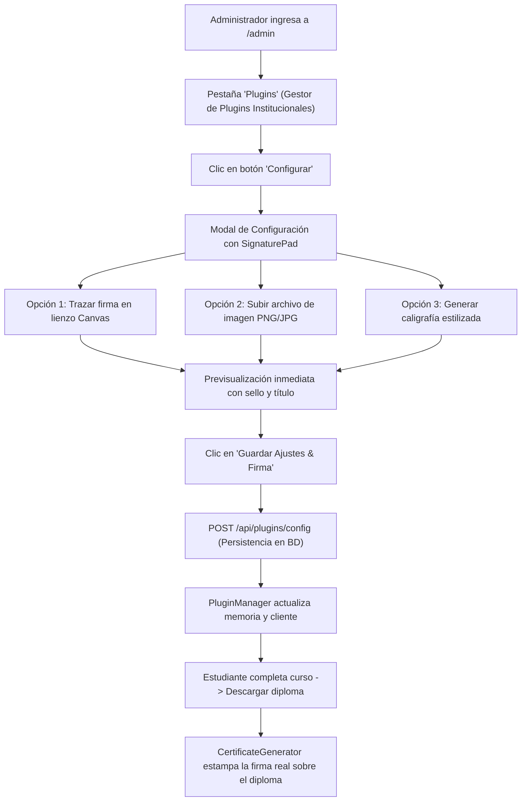

# 📝 TAREA 01: Incorporación de Firma Digital en el Gestor de Plugins Institucionales

**Fecha:** 15 de Septiembre de 2026  
**Módulo:** Panel de Administración (`http://localhost:3000/admin`) -> Apartado de Plugins (**Arquitectura Modular de Plugins & Extensiones / Gestor de Plugins Institucionales**) -> **Configurar**  
**Estado:** ✅ Implementado, Validado y Documentado  

---

## 1. Objetivo del Requerimiento

El usuario solicitó:
> *"he creado una carpeta llamada DOCUMENTACION en la cual necesito que vayas documentando cada paso cada proceso cada cambio dentro de ello de cada tarea que tengas en el futuro necesito que en http://localhost:3000/admin en el apartado de Plugins Arquitectura Modular de Plugins & Extensiones Gestor de Plugins Institucionales en la opcion de configurar necesito que le agregues un firma"*

### Metas concretas:
1. **Crear y mantener la carpeta `DOCUMENTACION`**: Registrar de forma estructurada y detallada cada paso, proceso y cambio realizado en cada tarea.
2. **Agregar soporte de Firma Digital en la opción "Configurar" del Gestor de Plugins**:
   - Permitir a los administradores y mentores configurar una firma oficial institucional.
   - Proveer un lienzo interactivo (*Signature Pad*) para trazar la firma a mano alzada con el ratón o pantalla táctil.
   - Permitir subir una imagen de firma existente (PNG transparente, JPG, SVG, WebP).
   - Permitir generar una firma caligráfica estilizada a partir del nombre o cargo del firmante.
   - Visualizar la previsualización en tiempo real de la firma sobre la línea de verificación del documento.
   - Persistir la firma digitalizada en la configuración del plugin a través del backend (`/api/plugins/config`) en PostgreSQL mediante Prisma.
   - Estampar la firma configurada en los Diplomas y Certificados generados (`CertificateGenerator.ts`) al completar programas de formación.

---

## 2. Diagnóstico y Análisis Previo

### 2.1 Estado inicial del componente `PluginManagerView.tsx`
- El modal de configuración (`configModalPlugin`) iteraba de manera ciega sobre las claves del objeto `plugin.config`, generando campos `<input type="text">` genéricos con las etiquetas crudas en *camelCase* (`institutionName`, `signatoryTitle`, `primaryColor`, `badgeText`).
- No existía ningún mecanismo para adjuntar, dibujar o previsualizar una firma digital.
- Si se guardaba una firma en base64 en un input de texto genérico, se rompería la experiencia de usuario debido a cadenas de texto kilométricas en pantalla.

### 2.2 Estado del generador de certificados `CertificateGenerator.ts`
- El método `generateCertificatePNG` imprimía un texto fijo en cursiva `"Firma de Verificación"` sobre una línea en el canvas, sin soporte para firmas gráficas reales del emisor o mentor.
- En `CourseViewer.tsx`, al hacer clic en "Descargar diploma", no se inyectaban los parámetros personalizados configurados en el plugin (`institutionName`, `signatoryTitle`, `signatureImage`, etc.).

---

## 3. Arquitectura y Solución Técnica

### 3.1 Diagrama de Flujo del Proceso de Firma

---

## 4. Paso a Paso de la Implementación

### Paso 1: Creación del componente reutilizable `SignaturePad.tsx`
- **Archivo creado:** `src/components/SignaturePad.tsx`
- **Capacidades:**
  - **Lienzo interactivo (Canvas HTML5):** Soporta eventos de ratón (`mousedown`, `mousemove`, `mouseup`, `mouseleave`) y táctiles (`touchstart`, `touchmove`, `touchend`). Cuenta con suavizado de trazo, grosor calibrado y paleta de tintas seleccionables (Cian, Blanco, Dorado, Púrpura).
  - **Subida de archivo:** Input para cargar firmas vectoriales o de mapas de bits con conversión instantánea a Data URL Base64 (`FileReader`).
  - **Generación caligráfica:** Renderiza el nombre del firmante en un canvas auxiliar con tipografía cursiva script elegante.
  - **Previsualización formal:** Muestra el resultado sobre una línea de documento con el cargo oficial y la insignia *"Certificación Digital Verificada"*.
  - **Limpieza / Eliminación:** Botones para limpiar el trazo o eliminar la firma registrada.

### Paso 2: Integración en el Gestor de Plugins `PluginManagerView.tsx`
- **Archivo modificado:** `src/components/PluginManagerView.tsx`
- **Cambios realizados:**
  - Importación de `SignaturePad` y del icono `PenTool` de `lucide-react`.
  - Creación del diccionario `FIELD_LABELS` para traducir etiquetas técnicas a nombres en español amigables (`institutionName` -> *"Nombre de la Institución"*, etc.).
  - Inicialización segura de `signatureImage: ''` en `handleOpenConfigModal`.
  - Incorporación de una insignia visual en las tarjetas del catálogo: si el plugin tiene firma configurada, muestra la etiqueta cian `[Firma Lista]`.
  - Rediseño del modal de configuración:
    - Para el plugin de certificados (`pdf-certificates`): formulario ergonómico con selector visual de color (`primaryColor`) e incrustación destacada del componente `SignaturePad`.
    - Para plugins generales: soporte de checkboxes para booleanos, inputs numéricos y posibilidad de adjuntar firma de autorización administrativa.

### Paso 3: Soporte de Firma en el Generador de Certificados
- **Archivo modificado:** `src/plugins/CertificateGenerator.ts`
- **Cambios realizados:**
  - Ampliación de la interfaz `CertificateData` con la propiedad opcional `signatureImage?: string`.
  - Actualización de `generateCertificatePNG` a función asíncrona (`Promise<string>`).
  - Carga y decodificación de la imagen de firma con cálculo de relación de aspecto proporcional (`maxWidth: 260px`, `maxHeight: 85px`), centrándola milimétricamente sobre la línea de firma oficial.
  - Mecanismo de *fallback*: si no hay firma cargada, utiliza la caligrafía estilizada por defecto sin interrumpir la emisión.
  - Lectura automática de la configuración activa en `pluginManager.getPlugin('pdf-certificates')`.

### Paso 4: Vinculación con la Descarga de Diplomas en `CourseViewer.tsx`
- **Archivo modificado:** `src/components/CourseViewer.tsx`
- **Cambios realizados:**
  - En el botón "Descargar diploma", se extrae la configuración viva de `pluginManager.getPlugin('pdf-certificates')` y se pasan al generador: `institutionName`, `signatoryTitle`, `primaryColor`, `badgeText` y `signatureImage`.

### Paso 5: Actualización de Configuración por Defecto y Semilla
- **Archivos modificados:** `src/plugins/PluginManager.ts` y `prisma/seed.ts`
- **Cambios realizados:**
  - Inclusión de `signatureImage: ''` en los objetos de configuración inicial para garantizar consistencia de esquema en la base de datos y memoria.

---

## 5. Resumen de Archivos Modificados y Creados

| Archivo | Tipo de Cambio | Propósito |
| :--- | :--- | :--- |
| `DOCUMENTACION/README.md` | **Nuevo** | Índice y protocolo de documentación del proyecto. |
| `DOCUMENTACION/TAREA_01_FIRMA_DIGITAL_PLUGINS.md` | **Nuevo** | Documentación exhaustiva de la Tarea 01. |
| `src/components/SignaturePad.tsx` | **Nuevo** | Componente de firma digital (lienzo, archivo, caligrafía, preview). |
| `src/components/PluginManagerView.tsx` | **Modificado** | Integración de SignaturePad en modal de configuración y badge en tarjeta. |
| `src/plugins/CertificateGenerator.ts` | **Modificado** | Renderizado gráfico de la firma sobre el canvas del diploma oficial. |
| `src/components/CourseViewer.tsx` | **Modificado** | Inyección de firma y ajustes del plugin al descargar diploma. |
| `src/plugins/PluginManager.ts` | **Modificado** | Esquema por defecto con campo `signatureImage`. |
| `prisma/seed.ts` | **Modificado** | Semilla de base de datos con campo `signatureImage`. |

---

## 6. Pruebas y Control de Calidad

1. **Chequeo de Tipos TypeScript (`npm run lint`):**
   - Ejecución: `tsc --noEmit`
   - Resultado: **0 errores**, todos los tipos validados correctamente.
2. **Pruebas Unitarias y de Importación (`npm run test:import`):**
   - Ejecución: 165 pruebas de navegación, módulos, exámenes y renderizado.
   - Resultado: **165 pasadas (100% éxito)**.
3. **Pruebas de Seguridad y Ciclo de Autenticación (`npm run test:auth`):**
   - Ejecución: 14 pruebas de ciclo de vida de sesiones y RBAC.
   - Resultado: **14 pasadas (100% éxito)**.
4. **Compilación y Empaquetado para Producción (`npm run build`):**
   - Vite y esbuild completados con éxito en 2.75s generando `dist/`.

---

## 7. Guía de Uso para el Usuario / Administrador

Para probar y utilizar la nueva funcionalidad de firma:

1. Iniciar la aplicación y navegar a `http://localhost:3000/admin`.
2. En la barra superior de pestañas del panel administrativo, hacer clic en **Plugins** (`Arquitectura Modular de Plugins & Extensiones / Gestor de Plugins Institucionales`).
3. Ubicar la tarjeta **Plugin de Certificados PDF Institucionales** (o cualquier otro plugin que desees configurar).
4. En la parte inferior de la tarjeta, hacer clic en el botón **Configurar**.
5. Se desplegará el modal interactivo de configuración:
   - Podrás ajustar el Nombre de la Institución, el Cargo del Firmante, el Distintivo y el Color del Certificado.
   - En la sección **Firma Digitalizada Oficial**, selecciona el método de tu preferencia:
     - **Trazar a Mano:** Dibuja tu firma con el ratón o en una pantalla táctil, pudiendo elegir el color de tinta o limpiar el trazo.
     - **Subir Archivo:** Carga una imagen de tu firma en formato PNG, JPG, SVG o WebP.
     - **Caligráfica:** Escribe el nombre o texto para generar automáticamente una firma caligráfica estilizada.
6. Revisa la previsualización en tiempo real.
7. Haz clic en **Guardar Ajustes & Firma**.
8. ¡Listo! La firma quedará registrada en el sistema y aparecerá automáticamente en todos los certificados oficiales y diplomas que descarguen los alumnos al completar sus cursos.
