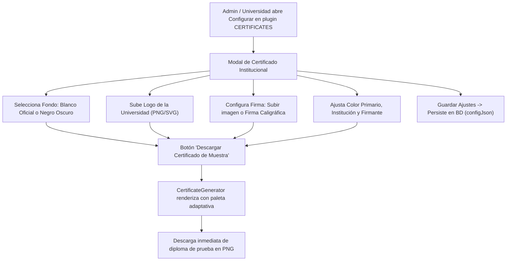

# 📝 TAREA 02: Personalización de Certificados (Fondo Blanco/Negro, Subida de Logo Universitario, Descarga de Muestra y Restricción Estricta de Firma a CERTIFICATES)

**Fecha:** 15 de Septiembre de 2026  
**Módulo:** Panel de Administración (`http://localhost:3000/admin`) -> Apartado de Plugins (**Arquitectura Modular de Plugins & Extensiones / Gestor de Plugins Institucionales**) -> **Configurar**  
**Estado:** ✅ Implementado, Validado y Documentado  

---

## 1. Objetivo del Requerimiento

El usuario solicitó:
> *"necesito que documentes tu proceso y necesito que elimines el trazo a mano necesito que permitas que puedan personalizar el fondo blanco y negro tambien necesito que agregues una opcion para poder descargar el certificado y tambien necesito que agregues una opcion para que las universidades puedan subir su logo al igual que solo los plugins que van a CERTIFICATES tenga esta opcion de firma"*

### Puntos clave a resolver:
1. **Eliminar el trazo a mano:** Retirar el modo de dibujo manual en lienzo (*Canvas draw*) del componente de firma, dejando exclusivamente la subida de imagen de firma digitalizada y la generación caligráfica profesional.
2. **Personalización de fondo (Blanco y Negro):** Permitir a la institución alternar entre fondo blanco oficial y fondo negro/oscuro elegante, ajustando automáticamente la paleta de colores de textos, líneas y sellos para garantizar legibilidad perfecta.
3. **Subida de Logo Universitario / Institucional:** Añadir un cargador de archivos para el logo de la universidad (PNG transparente, SVG, JPG) con previsualización en vivo y opción de eliminación.
4. **Descarga de Certificado de Muestra:** Integrar un botón directo dentro del modal de configuración para que el administrador o universidad pueda probar y descargar de inmediato un diploma PNG con todos sus datos, logo, fondo y firma aplicados.
5. **Restricción estricta de firma:** Asegurar que **ÚNICAMENTE** los plugins cuya categoría sea `certificates` dispongan de las opciones de firma, fondo y logo. Los demás plugins (exámenes, analítica, integraciones) muestran solo sus parámetros operativos propios.
6. **Documentación del proceso:** Registrar cada paso y cambio en la carpeta `DOCUMENTACION`.

---

## 2. Diagnóstico Previo

| Elemento | Estado Anterior | Problema Detectado |
| :--- | :--- | :--- |
| `SignaturePad.tsx` | Contenía modo "Trazar a Mano" con canvas de dibujo libre. | El dibujo con ratón producía trazos irregulares poco formales para diplomas universitarios. Se requería eliminarlo y conservar subida de imagen y caligrafía. |
| `CertificateGenerator.ts` | Solo admitía fondo oscuro fijo `#0a0a12`, sin soporte para logo ni fondos claros. | Imposibilidad de generar certificados sobre fondo blanco institucional o con el emblema de la universidad. |
| `PluginManagerView.tsx` | El modal para plugins ajenos a certificados incluía un SignaturePad genérico de autorización. | Incumplía la regla de negocio de que solo los plugins de certificados debían tener firma. |
| Previsualización / Descarga | No existía forma de previsualizar o descargar el certificado desde el panel de plugins sin completar un curso entero como estudiante. | Los administradores no podían verificar el aspecto visual del diploma configurado. |

---

## 3. Arquitectura y Solución Técnica

### 3.1 Flujo de Configuración del Certificado

### 3.2 Adaptación de Paleta Dinámica según Fondo

Cuando se selecciona el fondo **Blanco (`white`)**:
* Fondo de lienzo: `#ffffff`
* Texto principal (nombre del estudiante): `#111827` (gris muy oscuro / negro)
* Textos secundarios y títulos: `#374151`
* Texto atenuado y metadatos: `#6b7280`
* Líneas divisoras y marcos: `rgba(0,0,0,0.15)`
* Sello dorado: fondo atenuado `rgba(234, 179, 8, 0.12)` con borde y tipografía dorada brillante `#eab308`.

Cuando se selecciona el fondo **Negro / Oscuro (`dark`)**:
* Fondo de lienzo: `#0a0a12`
* Texto principal: `#ffffff`
* Textos secundarios: `#cbd5e1`
* Texto atenuado: `#94a3b8`
* Líneas divisoras y marcos: `rgba(255,255,255,0.2)`
* Sello dorado: fondo `rgba(234, 179, 8, 0.15)` con dorado `#eab308`.

---

## 4. Paso a Paso de la Implementación

### Paso 1: Refactorización de `SignaturePad.tsx` (Eliminación de trazo a mano)
* **Archivo:** `src/components/SignaturePad.tsx`
* Se eliminaron los métodos `startDrawing`, `draw`, `stopDrawing`, el canvas interactivo con listeners de mouse/touch, y los selectores de grosor y paleta de dibujo manual.
* Se conservaron y pulieron los dos modos profesionales:
  1. **Subir Archivo de Firma:** Carga imágenes de firma escaneadas o digitalizadas (PNG transparente, JPG, SVG, WebP) mediante `FileReader`.
  2. **Firma Caligráfica:** Generación automática de firma en script caligráfico elegante a partir del nombre del firmante.
* Previsualización integrada con línea de documento, cargo oficial y botón para eliminar firma.

### Paso 2: Adaptación del Generador `CertificateGenerator.ts`
* **Archivo:** `src/plugins/CertificateGenerator.ts`
* Se expandió la interfaz `CertificateData` con las propiedades:
  * `backgroundColor?: 'dark' | 'white' | 'black'`
  * `institutionLogo?: string`
* Se implementó la función auxiliar asíncrona `loadImage(src: string): Promise<HTMLImageElement | null>`.
* Se implementó el renderizado del **Logo Institucional / Universitario** en la parte superior del diploma, calculando la proporción de aspecto (`aspect ratio`) para ajustarlo de forma armónica antes del nombre de la institución.
* Se implementó la conmutación de paletas (blanco vs negro) para títulos, textos, líneas y sellos.
* Se mantuvo la función `downloadCertificate` exportada y asíncrona para su uso tanto en el modal como en la vista de cursos.

### Paso 3: Actualización de `PluginManagerView.tsx`
* **Archivo:** `src/components/PluginManagerView.tsx`
* **Restricción de firma:**
  * En la lista de tarjetas de plugins: la insignia `[Firma Lista]` solo se muestra si `plugin.category === 'certificates'`.
  * En el modal de configuración: se eliminó por completo el `SignaturePad` del bloque para plugins que no sean de certificados.
* **Nuevas opciones para plugins de certificados:**
  * **Fondo Blanco / Negro:** Botones interactivos con indicadores visuales para alternar entre *"Fondo Negro / Oscuro"* y *"Fondo Blanco Oficial"*.
  * **Logo Universitario:** Zona de subida de archivos (drag/click) con previsualización miniatura del logo cargado y botón de eliminación.
  * **Descarga de Certificado de Muestra:** Botón *"Descargar Certificado de Muestra"* que ejecuta `handleDownloadSampleCert`, generando un archivo PNG completo de prueba con todos los ajustes en tiempo real sin requerir guardar previamente.

### Paso 4: Vinculación en `CourseViewer.tsx`
* **Archivo:** `src/components/CourseViewer.tsx`
* Al invocar `downloadCertificate` para el estudiante que completa el curso, se inyectan ahora `backgroundColor: cfg.backgroundColor` y `institutionLogo: cfg.institutionLogo`, garantizando que el diploma oficial descargado por el alumno refleje fielmente el fondo y logo configurados por la universidad.

### Paso 5: Persistencia y Valores por Defecto
* **Archivos:** `src/plugins/PluginManager.ts` y `prisma/seed.ts`
* Se incluyeron en la configuración inicial del plugin `pdf-certificates`:
  * `backgroundColor: 'dark'`
  * `institutionLogo: ''`
  * `signatureImage: ''`

---

## 5. Archivos Modificados

| Archivo | Modificación |
| :--- | :--- |
| `src/components/SignaturePad.tsx` | Eliminado el modo de dibujo manual a mano alzada. Conservados modos Subir archivo y Caligráfica. |
| `src/plugins/CertificateGenerator.ts` | Agregado soporte de fondo blanco y negro adaptable y estampado de logo universitario. |
| `src/components/PluginManagerView.tsx` | Agregado selector de fondo, uploader de logo y botón de descarga de muestra. Eliminada firma de plugins no-certificados. |
| `src/components/CourseViewer.tsx` | Inyección de `backgroundColor` e `institutionLogo` al descargar diploma de alumno. |
| `src/plugins/PluginManager.ts` | Configuración por defecto actualizada con `backgroundColor` e `institutionLogo`. |
| `prisma/seed.ts` | Semilla de base de datos actualizada con los nuevos campos de certificados. |
| `DOCUMENTACION/README.md` | Actualizado el índice de documentación con la Tarea 02. |

---

## 6. Pruebas y Validación de Calidad

1. **Chequeo de Tipos TypeScript (`npm run lint`):**
   * Comando: `tsc --noEmit`
   * Resultado: **0 errores**. Tipos estrictos y limpios.
2. **Pruebas Automatizadas del Sistema (`npm run test:import`):**
   * Comando: 165 tests unitarios y de integración de cursos, navegación, módulos y exámenes.
   * Resultado: **165 pasadas (100% éxito)**.
3. **Compilación de Producción (`npm run build`):**
   * Comando: `vite build` + `esbuild`
   * Resultado: Compilado exitoso en 2.63s sin advertencias de sintaxis.

---

## 7. Guía de Uso para Administradores y Universidades

1. Dirígete a `http://localhost:3000/admin`.
2. Haz clic en la pestaña **Plugins** (*Gestor de Plugins Institucionales*).
3. En la tarjeta **Plugin de Certificados PDF Institucionales**, presiona el botón **Configurar**.
4. En el modal interactivo podrás:
   - Elegir el **Fondo del Certificado**: haz clic en *"Fondo Blanco Oficial"* para un diploma clásico formal o *"Fondo Negro / Oscuro"* para un estilo moderno.
   - En **Logo de la Universidad / Institución**: haz clic para subir el escudo o logotipo de tu universidad (PNG transparente recomendado).
   - En **Firma Oficial**: sube una imagen de la firma del director o genera una firma caligráfica.
   - En **Color Primario**: selecciona el color corporativo de la institución.
   - Haz clic en **Descargar Certificado de Muestra**: se generará y descargará inmediatamente el diploma PNG de prueba en tu equipo para comprobar el resultado.
5. Haz clic en **Guardar Ajustes** para aplicar la configuración a todos los alumnos que finalicen los programas formativos.
6. Si abres el modal de configuración de cualquier otro plugin (ej. Discord, Quizzes, Analytics), comprobarás que **no** muestran opciones de firma ni certificados, manteniéndose limpios con sus opciones propias.
